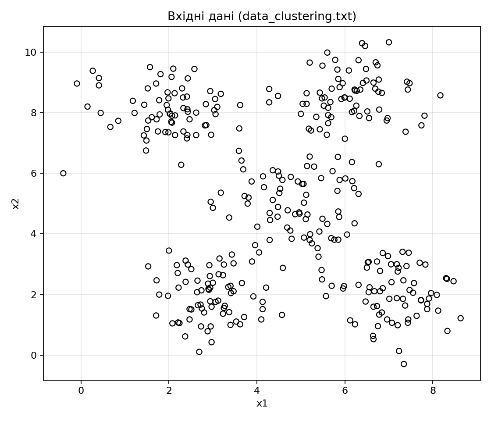
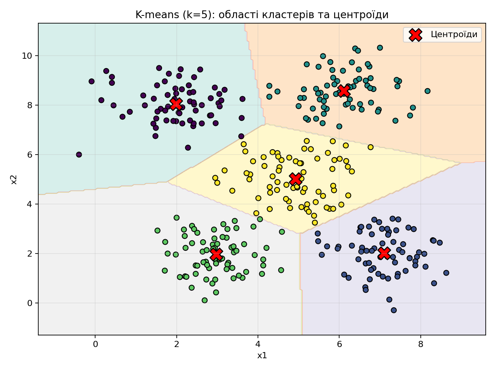
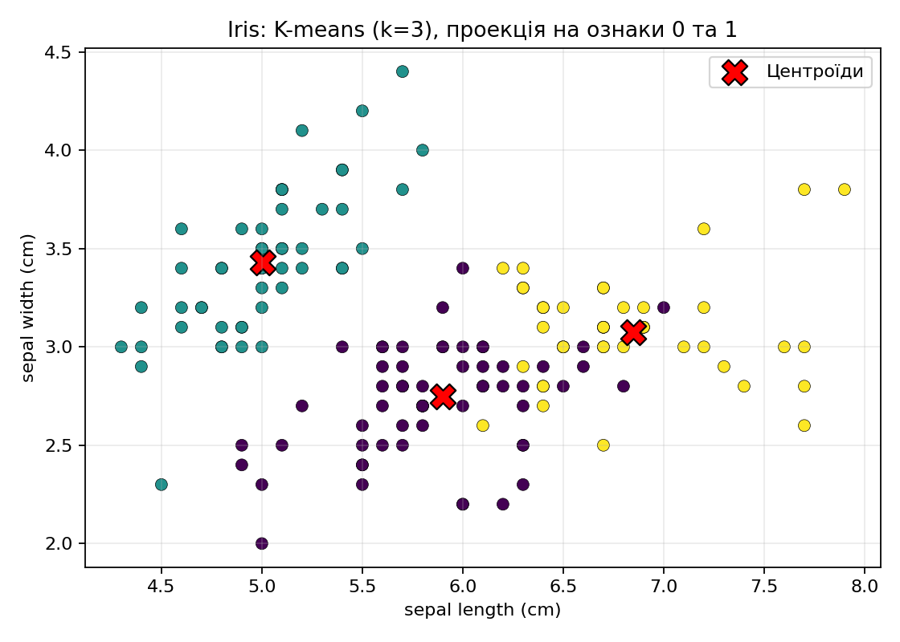
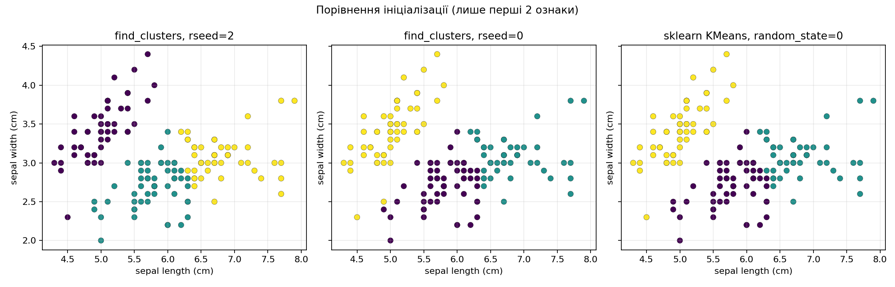
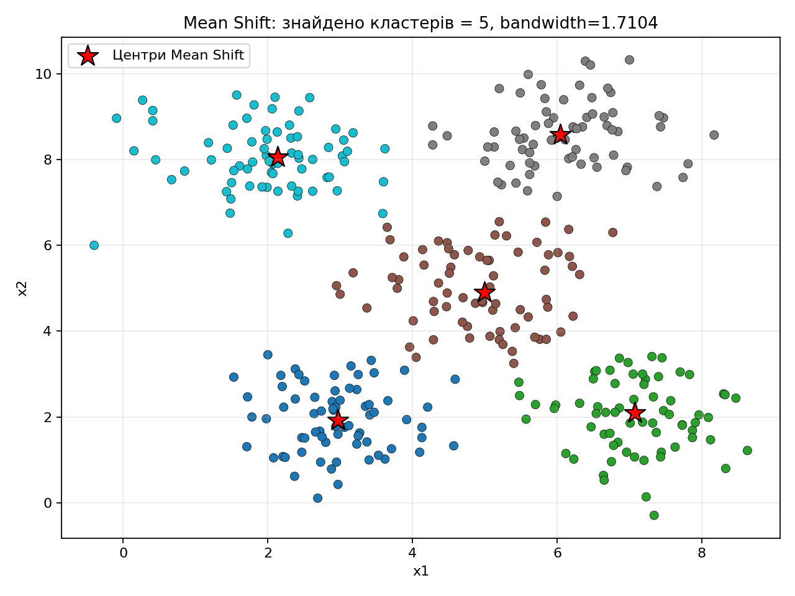
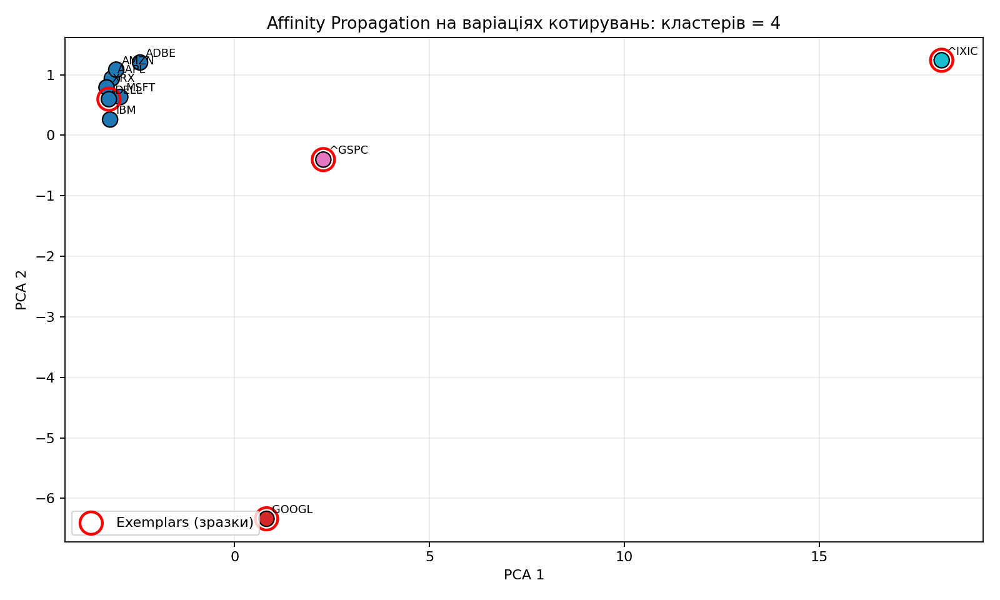

# Лабораторна робота №7 (файл методички: ЛР-7 «неконтрольоване навчання»)

**Тема:** дослідження методів неконтрольованого навчання (кластеризація).

Усі завдання виконані у Python (`scikit-learn`, `matplotlib`). Під кожним рисунком наведено пояснення, що саме на ньому видно і як це інтерпретувати. Після кожного завдання — **окремий висновок**.

---

## Завдання 1. Теоретичні відомості

**Що опрацьовано (коротко):**

- **Неконтрольоване навчання** — побудова моделі без міток класу; мета часто у відшуканні прихованих груп або структури даних.
- **Кластеризація** — розбиття об’єктів на підмножини так, щоб елементи одного кластера були «ближчі» за обраною метрикою (наприклад, евклідова відстань).
- **K-means** — параметричний за числом кластерів \(k\); ітеративно оновлює центроїди та приписування точок до найближчого центру.
- **Mean Shift** — непараметричний підхід до пошуку мод щільності; кількість кластерів виводиться з даних, сильно залежить від **bandwidth**.
- **Affinity Propagation** — кластеризація через «повідомлення» між точками; виділяє **зразки (exemplars)**; кількість кластерів залежить від **preference** та структури подібності.

### Висновок до завдання 1

Неконтрольовані методи дозволяють знайти природні групи в даних, але вимагають осмисленого вибору метрики, масштабування ознак і параметрів (для Mean Shift / AP), інакше результати можуть бути нестабільними або важко інтерпретованими.

---

## Завдання 2.1. K-means на `data_clustering.txt`

**Код:** `LR_7_task_1.py`  
**Дані:** двовимірні точки `x1, x2` з файлу `data_clustering.txt`.  
**Параметри:** `k = 5`, `init='k-means++'`, `n_init=10` (як у методичці за змістом).

### Рисунок 1 — вхідні дані

**Пояснення під рисунком.** На діаграмі розкидані всі спостереження у площині ознак. Візуально видно кілька ущільнень — це підказує, що дані можна розбити на кілька кластерів; точна кількість у методичці зафіксована як п’ять.

### Рисунок 2 — області кластерів і центроїди K-means

**Пояснення під рисунком.** Кольоровий фон — це «воронка» рішень: для кожної точки сітки показано, до якого кластеру її віднесе навчена модель. Кольори точок збігаються з їхніми кластерними мітками; **червоні хрестики** — знайдені центроїди. Межі між кольорами ілюструють нелінійні (кусково-постійні) регіони, які виникають через відстань до найближчого центроїда.

**Числові підсумки (за виводом програми):**

- Інерція (WCSS): **433.803**
- Розміри кластерів майже збалансовані: **[70, 68, 70, 71, 71]**

### Висновок до завдання 2.1

K-means стабільно виділив п’ять груп, близьких за розміром, що погоджується з візуальною наявністю п’яти ущільнень. Карта областей на сітці показує, як модель «розділяє» площину ознак між центроїдами; інерція характеризує сумарну внутрішньокластерну розкиданість після оптимізації.

---

## Завдання 2.2. K-means для набору Iris

**Код:** `LR_7_task_2.py`  
**Модель:** `KMeans(n_clusters=3, init='k-means++')` — три біологічні види.  
**Проекція:** перші дві ознаки (чашолисток) для 2D-графіка.

### Рисунок 1 — K-means на Iris (ознаки 0 і 1)

**Пояснення під рисунком.** Кольором показано кластерні мітки після навчання; **червоні хрестики** — центроїди у 2D-проекції. Навіть у двовимірній проекції видно, що одна з груп відділяється чіткіше, а дві інші частково перекриваються — це типова складність Iris для простих методів.

### Рисунок 2 — вплив ініціалізації (порівняння)

**Пояснення під рисунком.** Ліворуч і посередині — спрощена ручна схема `find_clusters` з різним `rseed`: стартові центри змінюються, тому межі кластерів у площині (0,1) можуть відрізнятися. Праворуч — `sklearn` KMeans з фіксованим `random_state`: результат відтворюваний. Це ілюструє тезу методички про важливість ініціалізації та перевагу `k-means++` / `n_init` у бібліотеці.

**Метрика узгодженості з істинними видами (не кластеризаційна мета, але корисна перевірка):**  
Adjusted Rand Index ≈ **0.7302** (висока узгодженість для K-means на повних 4 ознаках).

### Висновок до завдання 2.2

На Iris K-means з \(k=3\) дає осмислене розбиття, близьке до справжніх видів. Порівняння ініціалізацій показує чутливість простого k-means до старту, тоді як налаштований `sklearn` KMeans з `k-means++` і `random_state` забезпечує стабільний результат.

---

## Завдання 2.3. Mean Shift і оцінка кількості кластерів (`data_clustering.txt`)

**Код:** `LR_7_task_3.py`  
**Bandwidth:** `estimate_bandwidth(..., quantile=0.15)` — компроміс між «занадто багато дрібних кластерів» і «злиття кластерів».

### Рисунок — Mean Shift: мітки та центри

**Пояснення під рисунком.** Кольори — кластерні мітки після збігу Mean Shift; **червона зірка** — знайдені центри мод щільності. На цих даних алгоритм виявив **5** кластерів (узгоджується з візуальною структурою «п’ять хмар» і з K-means при \(k=5\)).

**Числові підсумки (за виводом програми):**

- Оцінений bandwidth ≈ **1.710**
- Кількість кластерів: **5**

### Висновок до завдання 2.3

Mean Shift без заданого \(k\) оцінив кількість груп, узгоджену з попереднім експериментом K-means на тих самих даних. Параметр `quantile` для bandwidth критичний: його зміна змінює «роздільну здатність» методу й кількість кластерів.

---

## Завдання 2.4. Affinity Propagation на фондових даних (matplotlib)

**Код:** `LR_7_task_4.py`  
**Дані:** `Stocks.csv` із `matplotlib/mpl-data/sample_data`.  
**Прив’язка тикерів:** локальний файл `company_symbol_mapping.json` (у сучасних збірках matplotlib JSON із методички може бути відсутній — додано еквівалент у репозиторії).

**Ознаки:** оскільки в `Stocks.csv` для кожної дати задано лише одне числове значення на тикер (без окремих Open/Close), як міру **варіації** використано приріст між сусідніми датами: \(\Delta p_t = p_t - p_{t-1}\) по кожному тикеру; далі для кожного тикера сформовано вектор останніх **48** приростів, стандартизація (`StandardScaler`), матриця подібності \(S = -\|x_i-x_j\|^2\) для `AffinityPropagation(affinity='precomputed')`.

### Рисунок — кластери та зразки (2D через PCA лише для візуалізації)

**Пояснення під рисунком.** Оскільки вихідний простір **48-вимірний**, для зручності показано **PCA-проекцію на 2D** (вона не використовується для навчання кластеризації, лише для графіка). Кольори — кластери; **червоні обведені точки** — **exemplars** (представницькі зразки). Підписи тикерів допомагають зіставити кластери з компаніями/індексами.

**Результат конкретного запуску (див. також `outputs_task4/affinity_report.txt`):** знайдено **4** кластери; наприклад, великий кластер об’єднує частину технічних тикерів, а окремі кластери можуть виділяти індекси `^GSPC`, `^IXIC` або тикери з іншою динамікою приростів.

### Висновок до завдання 2.4

Affinity Propagation знайшов підгрупи учасників ринку за профілем короткострокових варіацій цін. Результат залежить від вибору вікна, масштабування та `preference` (як і зазначено в методичці). Для наочної візуалізації багатовимірних ознак використано PCA-2D, а сама кластеризація виконана в повному просторі ознак.

---

## Загальний висновок по лабораторній

У роботі порівняно **K-means** (фіксоване \(k\)) і **Mean Shift** (оцінка \(k\) через bandwidth) на одних і тих самих 2D-даних: обидва підходи узгоджено вказали на **п’ять** природних груп. Окремо розглянуто **Iris** як класичний приклад чутливості до ініціалізації та якості розділення у проекціях. Нарешті, на реальних ринкових часових рядах показано застосування **Affinity Propagation** для пошуку підгруп за вектором недавніх приростів цін.
