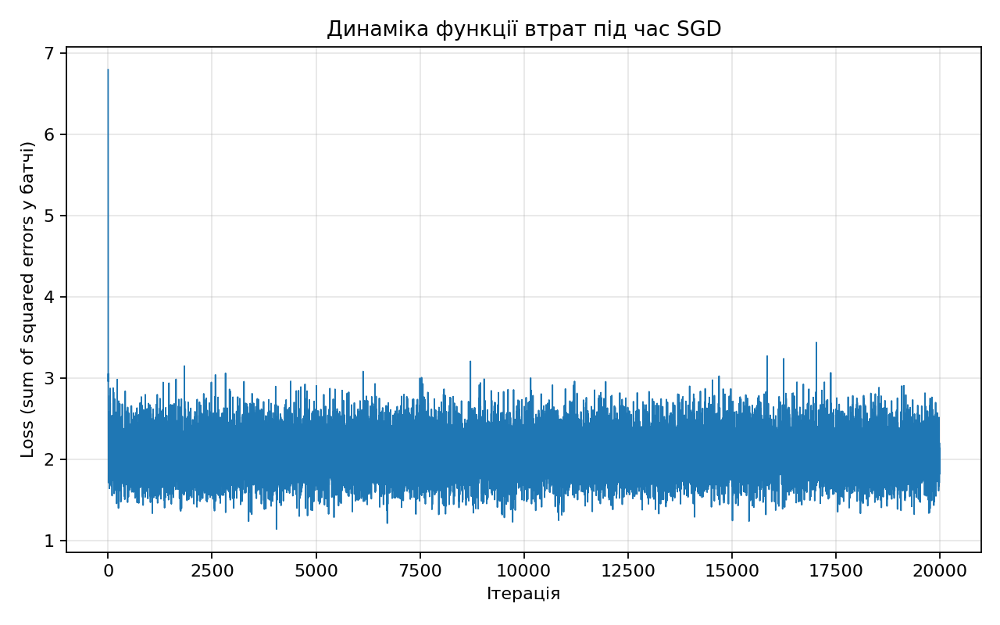
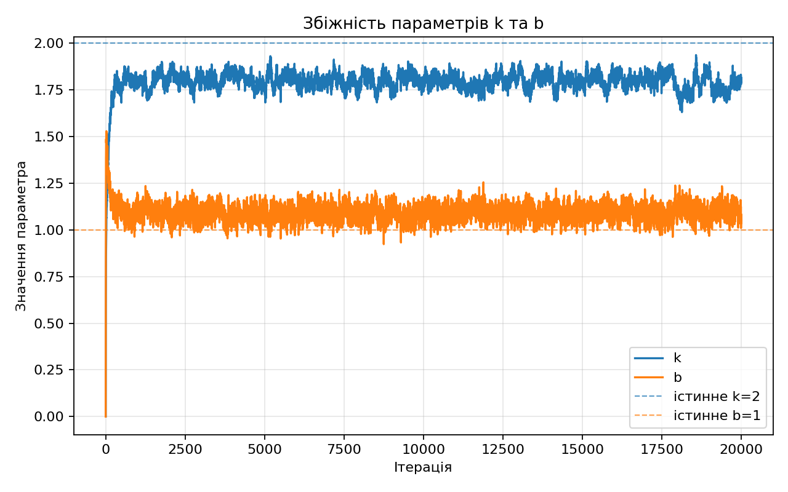
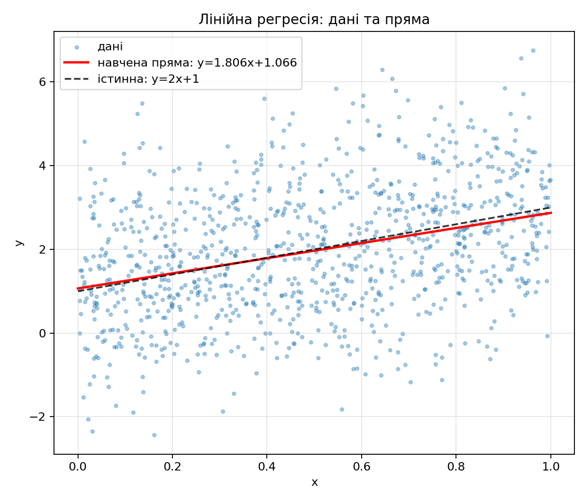
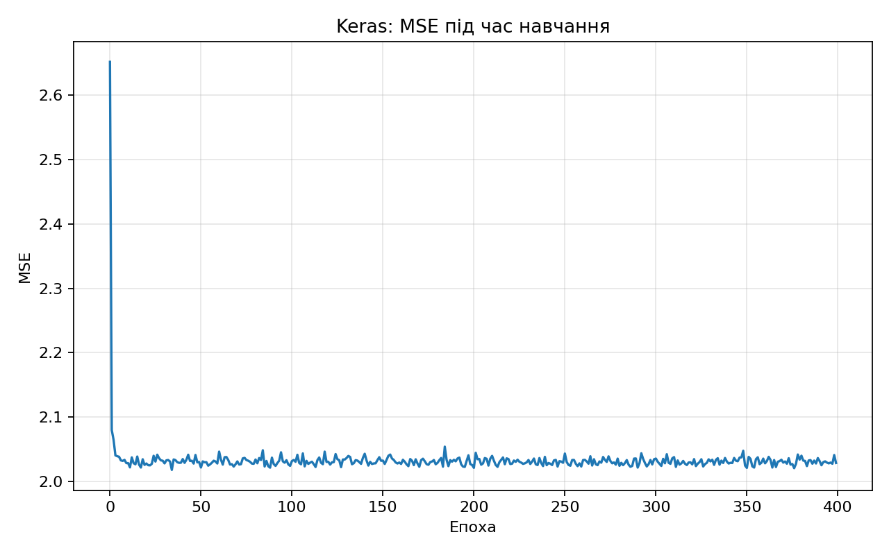
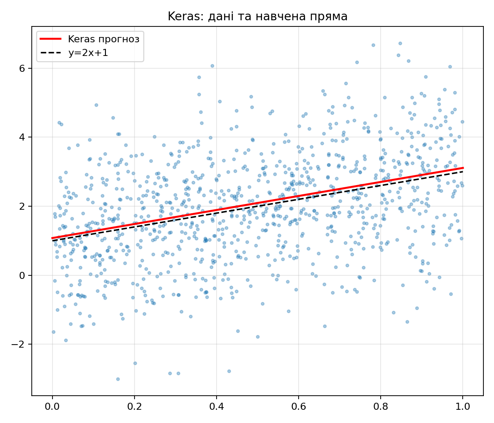

# Лабораторна робота 8: навчання нейромережі (TensorFlow / Keras)

Матеріал відповідає методичці **«СШІ_ЛР_8_НАВЧАННЯ_НЕЙРОМЕРЕЖ_TENSORFLOW»**: синтетичні дані лінійної залежності з шумом, побудова моделі, функція втрат, стохастичний градієнтний спуск, цикл навчання та візуалізація результатів.

---

## Частина 1. TensorFlow 1.x стиль у TensorFlow 2 (`tf.compat.v1`)

### Що зроблено

1. **Дані**: \(n = 1000\) точок \(x \sim U(0,1)\), шум \(\varepsilon \sim \mathcal{N}(0, \sigma)\) з \(\sigma = \sqrt{2}\) (дисперсія шуму 2, як у методичці), цільова залежність \(y = 2x + 1 + \varepsilon\).

2. **Граф**: `placeholder` для вхідних `X` та цільових `y`, навчальні змінні `k` та `b`, прогноз \(\hat{y} = kx + b\) через `tf.squeeze(k * X + b, axis=[-1])`.

3. **Втрата**: у методичці часто використовують суму квадратів помилок по міні-батчу (`tf.reduce_sum`). У скрипті `LR_8_tensorflow_linear_regression.py` для стабільності SGD мінімізується **середній** квадрат помилки по батчу — `tf.reduce_mean(tf.square(y - y_hat))`. Це той самий напрямок градієнта, що й для суми, але з іншим масштабом; тому крок навчання (`learning_rate = 0.08`) підібраний під цей варіант. Якщо повернути `reduce_sum`, зазвичай потрібен **менший** `learning_rate`, щоб уникнути розбігу або NaN.

4. **Оптимізація**: `GradientDescentOptimizer` на міні-батчах розміру 100, 20 000 ітерацій, логування кожні 100 кроків.

5. **Артефакти**: каталог `outputs/` — три PNG та `training_summary.txt` з фінальними `k`, `b` і останнім значенням loss на батчі.

### Графік 1 — динаміка втрати

**Пояснення.** По горизонталі — номер ітерації SGD (кожна точка — один крок з новим випадковим батчем). По вертикалі — MSE на поточному батчі. Крива **не монотонна**: це нормально для SGD, бо на кожному кроці мінімізується втрата на **іншій** вибірці з 100 точок. На початку втрата швидко падає (параметри рухаються до розумної області), далі залишаються коливання навколо значення порядку дисперсії шуму та помилки наближення на випадковому батчі.

**Висновок до графіка 1.** Поведінка loss підтверджує коректну роботу оптимізатора: швидке зниження на старті та наступна «хмара» значень відображають стохастичність міні-батчів, а не обов’язкову збіжність loss до нуля (істинна залежність зашумлена).

### Графік 2 — збіжність параметрів k і b

**Пояснення.** Синя лінія — оцінка кутового коефіцієнта `k`, помаранчева — вільного члена `b`. Пунктирні горизонталі — істинні значення \(k = 2\), \(b = 1\). Після початкового підйому параметри коливаються поблизу істинних значень; через шум у даних і випадковість батчів точне збігання з (2, 1) не гарантується — фінальні значення з `training_summary.txt` ближчі до «статистично розумної» прямої для даної вибірки.

**Висновок до графіка 2.** Параметри моделі стабілізуються в околі істинних коефіцієнтів, що підтверджує придатність лінійної моделі та SGD для цієї задачі. Невеликі відхилення від (2, 1) очікувані при обмеженій вибірці та гаусовому шумі.

### Графік 3 — дані та навчена пряма

**Пояснення.** Хмара точок — згенеровані \((x, y)\). Червона суцільна — пряма з навченими `k`, `b`. Чорна пунктирна — істинна залежність без шуму \(y = 2x + 1\). Червона лінія проходить крізь «середину» хмари та візуально близька до пунктирної; відмінність на кінцях інтервалу \([0,1]\) зумовлена випадковим шумом і тим, що оцінка зводить середню квадратичну помилку на **навчальній** вибірці.

**Висновок до графіка 3.** Візуально модель добре описує лінійний тренд у даних; це узгоджується з метою лабораторної — показати навчання найпростішої «нейромережі» (один шар, два параметри) у TensorFlow.

### Загальний висновок до частини 1 (TensorFlow graph API)

Реалізовано повний цикл у стилі TF1 у середовищі TF2: граф, сесія, `feed_dict`, ручний цикл по ітераціях. Отримані оцінки параметрів узгоджені з істинною прямою з урахуванням шуму. Варіант з `reduce_mean` замість `reduce_sum` слід явно згадати у звіті перед викладачем як свідомий вибір для чисельної стабільності та узгодження з кроком навчання.

---

## Частина 2. Та сама задача через Keras (`Sequential` + `Dense`)

### Що зроблено

Скрипт `LR_8_keras_linear_regression.py`: ті самі \(x\), шум і формула для \(y\); модель — один шар `Dense(1)` (лінійне перетворення \(kx + b\)); оптимізатор `SGD`, функція втрат `mse`; `fit` на 400 епохах, `batch_size=100`. Перший шар моделі — `Input(shape=(1,))`, щоб відповідати рекомендаціям Keras 3 і уникнути застарілого передавання `input_shape` лише в `Dense`.

### Графік 4 — MSE у Keras під час навчання

**Пояснення.** По осі X — номер епохи (`model.fit` проходить **весь** датасет за одну епоху, на відміну від однієї ітерації в ручному циклі TF, де один крок = один батч). Крива MSE зазвичай гладкіша, ніж у чистому SGD по одному батчу за крок, бо за епоху зроблено кілька оновлень на різних батчах і усереднення по епосі стабілізує картину. Зниження loss показує збіжність ваг і зміщення шару `Dense`.

**Висновок до графіка 4.** Keras коректно мінімізує MSE; динаміка втрати відображає успішне навчання лінійного шару без ручного циклу `sess.run`.

### Графік 5 — дані та пряма Keras

**Пояснення.** Аналогічно до TF-графіка: розкид точок, червона лінія — прогноз моделі на сітці \(x\), пунктир — \(y = 2x + 1\). Через інший seed (`np.random.default_rng(11)` проти `7` у TF-скрипті) та іншу кількість епох/крок навчання чисельні `k`, `b` у Keras **не обов’язково** збігаються з фінальними значеннями з TensorFlow-скрипта, але обидві моделі мають наближатися до тієї ж істинної залежності.

**Висновок до графіка 5.** Високорівневий API Keras дає той самий тип результату (лінія регресії вздовж хмари точок) з меншим обсягом коду; це ілюструє перехід від «нижньорівневого» графа до декларативного опису моделі з `compile` / `fit`.

### Загальний висновок до частини 2 (Keras)

Keras підтверджує еквівалентність задачі: один нейрон без нелінійності — це лінійна регресія. Порівняння з частиною 1 корисне для розуміння, що `Dense` + `MSE` + `SGD` реалізують ті самі ідеї, що й явний граф TensorFlow, але з автоматизацією зворотного проходу та метрик.

---

## Підсумок по лабораторній

| Аспект | TensorFlow `compat.v1` | Keras |
|--------|------------------------|--------|
| Опис моделі | Placeholders, змінні, формула в графі | `Sequential`, `Input`, `Dense(1)` |
| Навчання | Цикл `sess.run` + `feed_dict` | `model.fit` |
| Втрата | MSE по батчі (`reduce_mean`) | `loss="mse"` |
| Графіки | `outputs/*.png` | `outputs_keras/*.png` |

Обидва підходи виконують завдання методички: синтетичні дані, навчання параметрів лінійної моделі, аналіз динаміки втрати та візуальна перевірка наближення до \(y = 2x + 1\). Для звіту до викладача достатньо посилатися на цей файл, згенеровані зображення та вміст `outputs/training_summary.txt`, а також коротко пояснити різницю **`reduce_sum` / `reduce_mean`** і стохастичність SGD.
